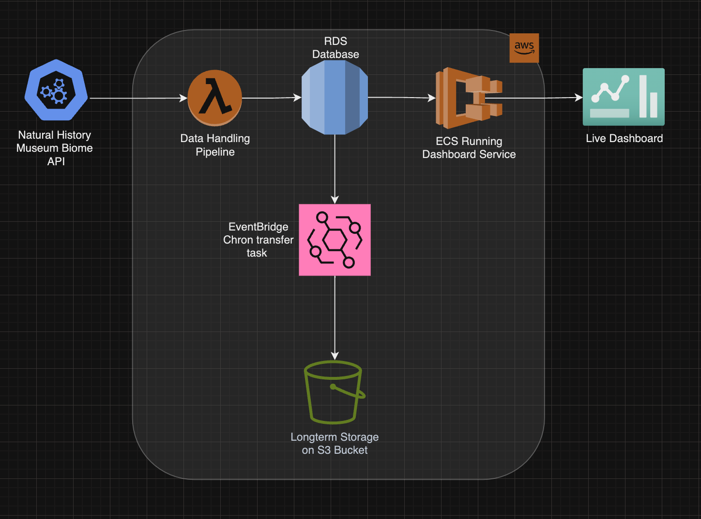
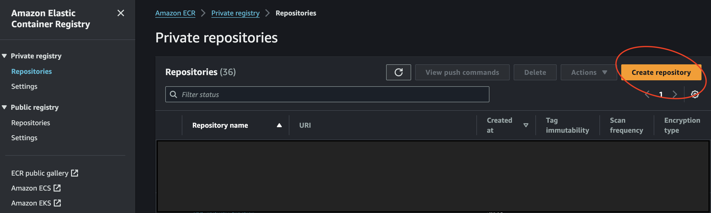
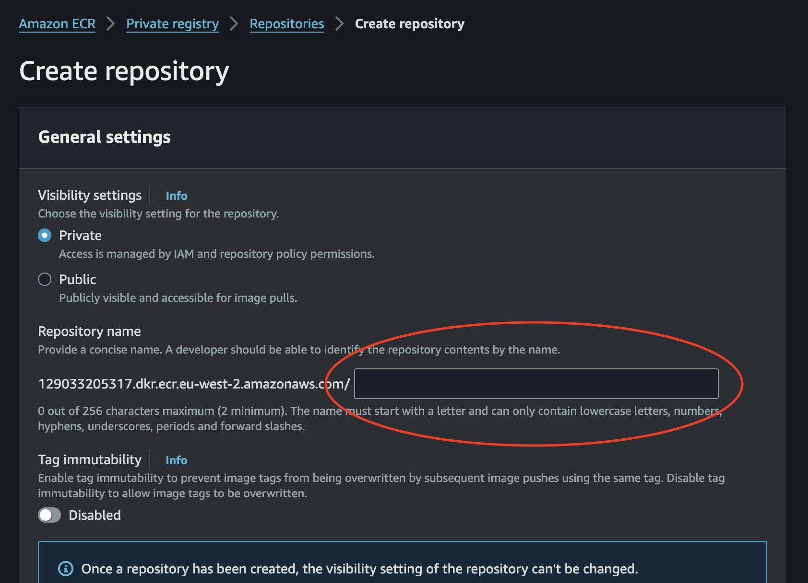
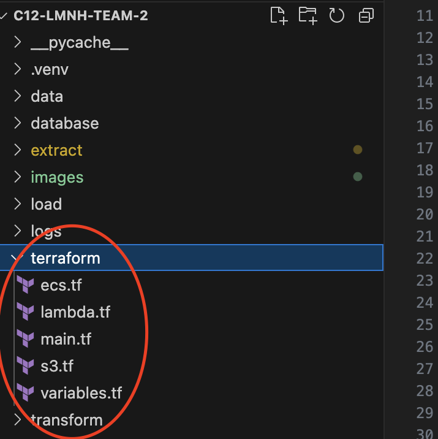

# Team 2 LMNH Group Project

This is the repository for a project with the Liverpool Natural History Museum. The museum hosts a large conservatory that houses a large variety of plants from around the world. We have created an ETL pipeline to aid in monitoring the sheer number of plants to ensure that they are being kept in their appropriate environments.

## Pipeline architecture

This repository contains all the files needed to set up our ETL (extract, transform, and load) pipeline. Our Python ETL scripts are dockerised into a container that is then implemented into our cloud infrastructure:



## Setup guide

### 1\. Install Microsoft SQL server and the required drivers

**Step 1: Install the ODBC Driver 17 for SQL Server**

Install the ODBC Driver 17 for SQL Server For macOS, you can install the ODBC driver using the msodbcsql17 package from Microsoft:

```
sh 
brew tap microsoft/mssql-release <https://github.com/Microsoft/homebrew-mssql-release> 
brew update 
brew install msodbcsql17
```

**Step 2: Update Your Environment**

After installing the driver, make sure to restart your terminal or re-source your shell profile to update the environment variables: sh source ~/.zshrc # or source ~/.bash_profile, depending on the shell you use

**Step 3: Verify the Driver Installation**

You can verify that the driver was installed correctly by using the odbcinst command: sh odbcinst -j The output should include information about ODBC Driver 17 for SQL Server.

### 2\. Dockerise the ETL pipeline

Firstly, ensure that Docker is installed on your device then run the following commands in the directory stated:

```
# build the dashboard container
c12-LMNH-team-2 % docker build -t dashboard_container --platform "linux/amd64" . 

# build the pipeline container
c12-LMNH-team-2 % docker build -t c12-team2-etl-lambda --platform "linux/amd64" .
```

### 3\. Uploading the containers to ECR

In the AWS console, type ECS and click create repository:



Create two private repositories, name one of them "_dashboard_container_" and give the other one a suitable name for the lambda function that runs the ETL pipeline:



### 4\. Setting up the terraform script

Go into the terraform folder of this repository:



Input the details required in the terraform scripts as stated by the code comments.

```
terraform
# ECS Task Definition

<your-docker-image>"  # Replace with your Docker image URI
    essential = true</your-docker-image>
```

Ensure you read and resolve all the code comments in the following files:

```
ecs.tf
lambda.tf
s3.tf
```

## Accessing the dashboard

## Additional features

## README TODO LIST

- confirm the directories where the docker images will be created
