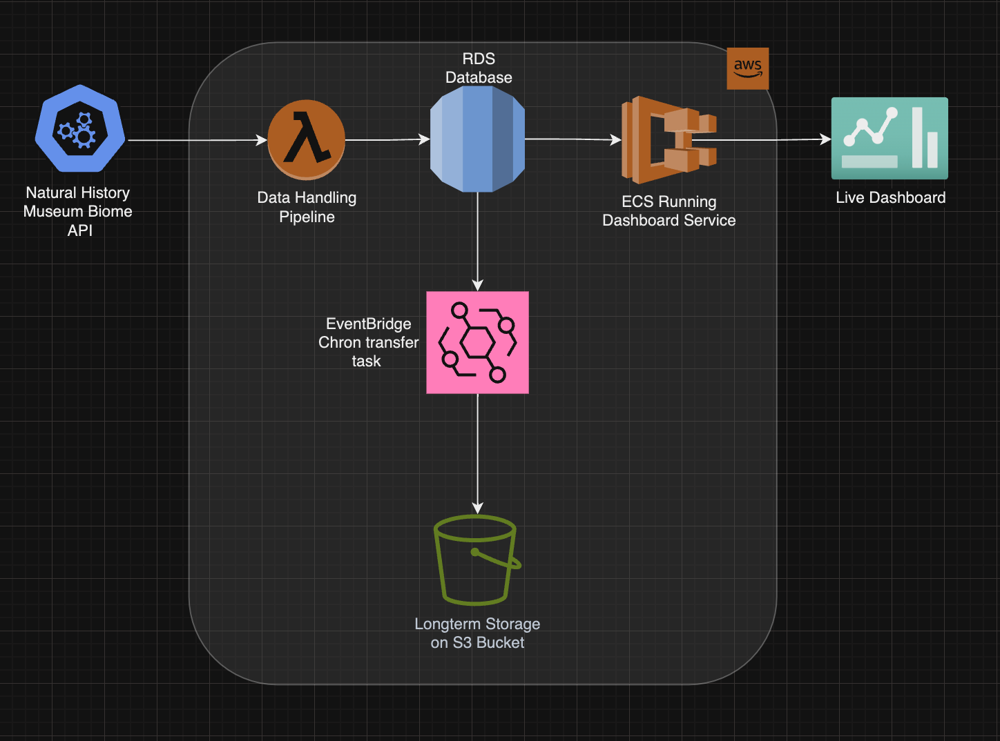

# team 2 LMNH group project
This is the repository for a project with the Liverpool Natural History Museum. The museum hosts a large conservatory that houses a large variety of plants from around the world. We have created an ETL pipeline to aid in monitoring the sheer number of plants to ensure that they are being kept in their appropriate environments.


## Pipeline architecture
This repository contains all the files needed to set up our ETL (extract, transform and load) pipeline. Our Python ETL scripts are dockerised into a container that is then implemented into our cloud infrastructure:



## Setup guide

### 1. Dockerise the ETL pipeline

Firstly, ensure that Docker is installed on your device then run the following commands in the directory stated:

```
# build the dashboard container
c12-LMNH-team-2 % docker build -t dashboard_container --platform "linux/amd64" . 

# build the pipeline container
c12-LMNH-team-2 % docker build -t c12-team2-etl-lambda --platform "linux/amd64" . 
```

### 2. Uploading the containers to ECR

### 3. Setting up the terraform script

## Accessing the dashboard

## Additional features

